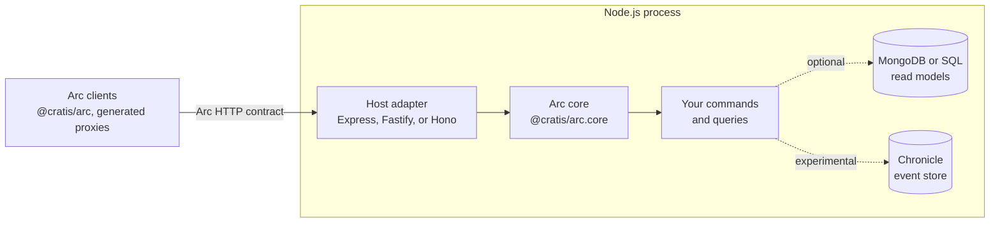

Arc for TypeScript is built so the same command and query code can run behind Express, Fastify, or Hono, with or without a database or an event store. This page explains the boundaries that make that possible and the places where TypeScript forces a different design from Arc on .NET.

:::caution[Source preview]
Package names are working names, and APIs are not final. For what is supported today, see the [capability reference](reference/capabilities.md).
:::

## Three layers

- **The core** owns everything that defines Arc behavior: the command and query pipelines, route conventions, result envelopes, validation, authorization, authentication handlers, correlation, and tenancy. It does not import an HTTP framework or a storage driver.
- **A host adapter** translates between one HTTP framework and the core. It routes matching requests to the core, hands over the raw body and a cancellation signal, and writes the response. It adds no Arc behavior of its own.
- **Integrations** give commands and queries somewhere to read and write. They are separate packages that depend on the core, never the other way around. `@cratis/arc.mongodb` serves tenant-scoped MongoDB collections, `@cratis/arc.drizzle` serves tenant-scoped SQL reads, and `@cratis/arc.chronicle`, experimental and not published to npm, appends events returned from a command; its live-kernel suite covers Express, Fastify, and Hono. It supports command-scoped event batches, aggregates, and reactor-returned commands; see the [Chronicle capability reference](reference/capabilities.md#persistence-and-chronicle) for remaining limits.
- **Build-time tooling** sits beside the runtime. `@cratis/arc.proxygenerator` reads your TypeScript source and writes proxies for the published `@cratis/arc` client, and `@cratis/eslint-plugin-arc-core` checks decorated artifacts in the editor. The core does not depend on `@cratis/arc` or on browser code.

Keeping the core framework-independent means a behavior is implemented and tested once, and every adapter inherits it. A difference between adapters is either a limit of the host framework, documented per adapter, or a bug.

## What the core owns and what an adapter owns

| Concern | Core | Host adapter |
| --- | --- | --- |
| Routes and methods | Derives routes from declarations; decides which methods each route accepts | Express and Fastify send only requests whose raw path exactly matches an Arc route; Hono hands every request to the core, which matches the request URL's path. Every other request stays with the application |
| Request bodies and query strings | Enforces the size limit, parses, binds, and validates; turns malformed input into a `malformedRequest` result | Hands the body over unparsed |
| Command and query execution | Runs the pipeline, including authorization before validation | Nothing |
| Results and status codes | Builds the envelope and selects the status code | Writes the status, headers, and body |
| Correlation and tenancy | Resolves the correlation ID and tenant, and makes them available to the running operation | Nothing |
| Authentication and authorization | Runs the configured authentication handlers, then evaluates authorization against the principal | Nothing by default. With `nativePrincipal: true`, passes on a principal the host already verified, through an explicit callback |
| Cancellation | Passes the signal to every callback as `context.signal` | Express and Fastify abort it when the client disconnects; Hono passes the request's own signal |

Observable queries use the same split. The core owns the subscription pipeline, snapshots, server-sent events, and the WebSocket protocol. Each adapter owns how a WebSocket upgrade reaches the core, because Express, Fastify, and Hono accept upgrades differently; [WebSockets](hosts/websockets.md) shows each one.

## The request path

Arc on .NET defines the order in which a request is processed, and the TypeScript core follows it:

1. The adapter receives the request and hands it to the core.
2. The core resolves the correlation ID, runs authentication handlers, and resolves the tenant.
3. Authorization runs first. A denied caller gets 401 or 403 and no validation output, so rule messages never leak to a caller who may not run the operation.
4. Validation runs. `POST <command-route>/validate` stops here and never runs the handler.
5. For a command, execution scopes begin, `provide` and `handle` run, and the scopes complete. For a query, `perform` runs, and an array result is sorted and paged.
6. The core builds the result envelope and selects the status code in the contract's order: 200, then 403, 400, 202, and 500.

A result that fails at any step never carries a response value. Outside development, exception messages and stack traces are replaced before serialization, and the correlation ID stays.

## Idiomatic TypeScript, not a port

Parity means the same observable behavior on the wire, not the same implementation. Several .NET mechanisms have no direct TypeScript equivalent:

| Arc on .NET relies on | Arc for TypeScript |
| --- | --- |
| Attributes and runtime reflection (`[Command]`, `[ReadModel]`, parameter types) | Decorators (`@command()`, `@readModel()`, `@query()`, Fundamentals `@field`). TypeScript erases types at runtime, so fields name their wire type, and query parameters and injected services are listed in order. The builder discovers decorated classes in a folder, or you add them explicitly. Zod-backed `defineCommand` and `defineQuery` remain the low-level path |
| Dependency injection with per-request scopes | Class or `serviceToken` tokens with singleton, scoped, or transient registrations. Each operation owns a scope; singleton construction belongs to the registry and receives no request identity. There is no integration with another container |
| `AsyncLocal` ambient context | Node.js `AsyncLocalStorage`, with a frozen context per request or direct call, so one request's principal, tenant, or correlation never leaks into another |
| `CancellationToken` | `AbortSignal` |
| `IObservable<T>` and `ISubject<T>` | RxJS `BehaviorSubject` (200 current snapshot), `Subject`/`Observable` (202 pending snapshot), an async iterable, or a structural subscribable. `CurrentValueSubject` remains available but is deprecated |
| `IQueryable<T>` paging and sorting | In-memory paging and sorting of arrays, or a page the data source already cut, returned with `queryPage` |
| FluentValidation and DataAnnotations | Field types for shape, and `CommandValidator`, `QueryValidator`, and `ConceptValidator` classes with `ruleFor` rules. The low-level path uses Zod schemas and validator functions |
| Roslyn analyzers and a proxy generator that reads compiled assemblies | ESLint rules for decorated artifacts, and a generator that reads your TypeScript source through the compiler API without running it. See [Code analysis](code-analysis/index.md) and [Proxy generation](proxy-generation/index.md) |

Some differences are in the language itself and affect the wire:

- JavaScript numbers are 64-bit floating point. Integers above 2^53 − 1 lose precision unless they travel as strings.
- `undefined` and `null` are different values, and JSON has no `undefined`. Omitted and explicit-null input have to be handled deliberately.
- Dates, times, and GUIDs cross the wire as strings. `@cratis/fundamentals` provides the `DateOnly`, `TimeOnly`, and `Guid` types the generated clients use.
- Node.js runs one event loop per process. A handler that blocks the loop blocks every request.

## Safety choices that differ from Arc on .NET

Where following Arc on .NET exactly would let a remote caller weaken a check, Arc for TypeScript chooses the safer behavior and documents it:

- An HTTP client cannot raise the allowed validation severity to `Error`, so business-rule errors always block. Only trusted code calling `executeCommand` can.
- Tenant and security checks belong in `authorize`, which no severity setting affects.
- A configured tenant resolver is final; there is no silent fallback to a header.
- Unsafe names, paths, body limits, and contradictory authorization declarations stop the server at startup.

The full list is in the [capability reference](reference/capabilities.md#deliberate-differences).

## Integrations stay outside the core

Arc on .NET adds event sourcing through its Chronicle integration: a command returns events, and they are appended only when the command succeeds. Arc for TypeScript keeps the same boundary. The core never depends on Chronicle, and the experimental integration is a separate package built on the Chronicle TypeScript client, `@cratis/chronicle` 6.7.0, through the core's response value handler and command read-model extension points. Namespace, correlation, and event routing are passed explicitly per request.

The integration covers the main Chronicle command paths. Events returned by a command and events applied to a keyed [aggregate](chronicle/aggregates/index.md) are staged, together with those of nested commands, and appended in one `appendMany` batch after the outer command succeeds. A Chronicle reactor can return Arc commands, which run through the full command pipeline. An opt-in live-kernel suite exercises returned events, batches, aggregates, reactor commands, and concurrency rejections through Express, Fastify, and Hono.

The integration stays experimental, and full parity with Arc on .NET is unverified. The known gaps:

- The batch covers one event log. It is not a transaction across other stores or external calls, and an immediate SDK append inside `handle()` is outside it. See [Transactional commands](chronicle/commands/transactional-commands.md).
- The aggregate loads only the event source named by the command key, and has no `Failed(...)` or `OnActivate`.
- The TypeScript SDK has no reactor replay exclusion, so reactors that return commands must tolerate re-delivery.
- Reads through Chronicle return decrypted read models. Arc releases encrypted personal data at its query edge only for protected read models decoded into their exact class from a direct MongoDB read; raw documents, derived subtypes, and mapped objects need an explicit `readModels.release` call. See [Compliance](chronicle/compliance.md).
- There are no `ARCCHR` analyzers.

See [Chronicle](chronicle/index.md).

The MongoDB and Drizzle integrations follow the same rule: the application owns the client or database, the tenant mapping, and the filter or predicate. See [MongoDB](mongodb/index.md) and [SQL with Drizzle](sql/index.md).

## Related

- [Arc HTTP contract](/arc/http-contract/)
- [Capability reference](reference/capabilities.md)
- [Understanding the proxy boundary](/arc/understanding-the-proxy-boundary/)
- [CQRS without event sourcing](/arc/arc-without-event-sourcing/)
