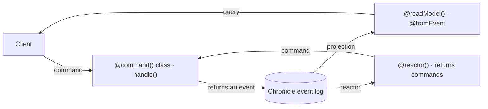

A librarian registers an author. You want that registration kept as a fact, and you want the author list on screen to update from it. Without an integration, every command opens a Chronicle client, picks the event store namespace for the caller's tenant, appends inside `handle()`, turns constraint violations into validation results, and takes care never to append when validation has already failed.

`@cratis/arc.chronicle` removes that plumbing. A command **returns** the event, and Arc appends it after authorization, validation, and `provide()` have passed, in the namespace of the tenant Arc already resolved. Arc does not require event sourcing: a command can do its work through any service. Use this integration when you want commands to record facts in [Chronicle](/chronicle/), the event-sourcing database.

:::caution[Experimental]
`@cratis/arc.chronicle` is experimental, and, like every package in this repository, it is not published to npm. Its APIs can change. The [capability reference](../reference/capabilities.md#persistence-and-chronicle) has its status and the checks behind it.
:::

## How the pieces fit

Arc and Chronicle meet at one loop. A command returns an event, Chronicle appends it and projects it into a read model, and an Arc query serves that read model back to the client.



The [Library sample](https://github.com/Cratis/Arc.TypeScript/tree/main/Samples/Library) walks that loop. Registration returns the event:

```typescript title="Features/Authors/Registration/Registration.ts (excerpt)"
@eventType()
export class AuthorRegistered {
    @field(AuthorName) name: AuthorName;
    constructor(name: AuthorName = new AuthorName('')) { this.name = name; }
}

@command()
@roles('Librarian')
export class RegisterAuthor {
    @key() @field(AuthorId) id!: AuthorId;
    @field(AuthorName) name!: AuthorName;

    handle(): AuthorRegistered { return new AuthorRegistered(this.name); }
}
```

The listing projects that event into a read model and serves it:

```typescript title="Features/Authors/Listing/Listing.ts (excerpt)"
@readModel()
@fromEvent(AuthorRegistered)
export class Author {
    @field(AuthorId) id!: AuthorId;
    @field(AuthorName) name!: AuthorName;

    @query({ observable: true }, service(ChronicleReadModels))
    static allAuthors(models: ChronicleReadModels): Observable<Author[]> {
        return models.observeAll(Author, author => author.id.toString());
    }
}
```

The `@key()` field names the event source, so the registration lands in that author's stream. `@fromEvent(AuthorRegistered)` asks Chronicle to copy the event's matching properties into `Author`, keyed by the event source. The observable query then pushes a new author list to the browser whenever the projection changes. Appending and projecting are separate steps inside Chronicle, so a successful command can return before the list has caught up.

## What the integration adds

- **Returned events are appended.** `handle()` returns one event, several, or events beside a response. See [Returning events](commands/index.md).
- **Metadata comes from the command.** The event source, stream, subject, and causation are resolved from the command and the request. See [Event metadata](commands/event-metadata.md).
- **Tenants map to namespaces.** Every append and read uses the tenant of the current execution as the Chronicle namespace.
- **Rejections become validation results.** A constraint or concurrency violation answers 400, and nothing is appended.
- **Nested commands share one batch.** Returned events from nested commands are appended together, or not at all. See [Transactional commands](commands/transactional-commands.md).
- **Current state is a parameter.** A command can take its own read model or a rehydrated aggregate as a `handle()` argument. See [Read models in commands](read-models/injecting-into-commands.md) and [Aggregates](aggregates/index.md).
- **Reactors can return commands.** A Chronicle reactor returns an Arc command, and Arc runs it through the full command pipeline. See [Reactors](reactors/index.md).

## Find your way

| Page | Use it when you want to |
| --- | --- |
| [Add event sourcing](add-event-sourcing.md) | Register Chronicle with the application builder |
| [Returning events](commands/index.md) | Return one event, a batch, or events next to a response |
| [Event metadata](commands/event-metadata.md) | See what each appended event carries and where every value comes from |
| [Resolving the event source ID](resolving-event-source-id.md) | Choose which event source an event is appended to, and route it |
| [Subject](commands/subject.md) | Record whose personal data an event carries |
| [Concurrency](commands/concurrency.md) | Reject an append when the stream moved |
| [Causation and auditing](commands/causation.md) | See what the permanent causation chain records, and keep secrets out |
| [Transactional commands](commands/transactional-commands.md) | Understand the batch across nested commands and its failure rules |
| [Read models](read-models/index.md) | Serve projected state from queries |
| [Read models in commands](read-models/injecting-into-commands.md) | Decide or validate from the state projected for the command's key |
| [When read model resolution fails](read-models/failures.md) | Understand a rejected command that loads a read model |
| [Aggregates](aggregates/index.md) | Decide from one event source's full history |
| [Reactors](reactors/index.md) | Run a follow-up command when an event is recorded |
| [Compliance](compliance.md) | Know what the integration does, and does not do, for personal data |
| [Code analysis](code-analysis.md) | See which .NET `ARCCHR` diagnostics apply in TypeScript |
| [Testing Chronicle commands](../testing/chronicle.md) | Assert returned events without a kernel |

## Where it stops

- A command's events go to one event log in one event store. There is no transaction across other stores or external calls.
- An event appended directly through the SDK inside `handle()` is outside the command's batch.
- Arc does not release encrypted personal data when it serves a read model. See [Compliance](compliance.md).
- The TypeScript SDK has no replay exclusion for reactors, so a reactor that returns commands must tolerate running again.
- No `ARCCHR` analyzers exist for TypeScript. See [Code analysis](code-analysis.md).

Start with [Add event sourcing](add-event-sourcing.md).

## Related

- [Chronicle TypeScript client](https://github.com/Cratis/Chronicle.TypeScript), where the SDK is developed
- [CQRS without event sourcing](/arc/arc-without-event-sourcing/)
- [Capability reference](../reference/capabilities.md#persistence-and-chronicle)
