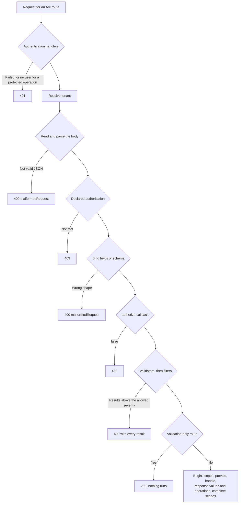

Every command passes through the same stages in the same order, whichever host delivered it. Knowing that order explains most results: why a denied caller never sees rule messages, why a malformed body answers 400 before a role check, and why `/validate` never touches your handler.

## The stages

| Step | You configure it with | When it fails |
| --- | --- | --- |
| 1. Authentication | `authentication` handlers, or a native principal | 401 |
| 2. Tenant | `tenancy.httpHeader`, `tenancy.sources`, or `tenancy.resolve` | Does not reject by default; `tenancy.required` answers 400 and a membership check 403 |
| 3. Read the input | Nothing | 400 `malformedRequest` |
| 4. Declared authorization | `@roles`, `@authorize`, `@allowAnonymous`, or `authorization` | 403 |
| 5. Bind the input | `@field` declarations, or a Zod `schema` | 400 `malformedRequest` |
| 6. Per-request authorization | `authorize(input, context)` on a low-level definition | 403 |
| 7. Validation | Validators, concept validators, then `validate` and `filters` | 400 with every result collected |
| 8. Execute | Execution scopes, `provide()`, `handle()`, response value handlers, operations | 400, 403, or 500 from the outcome |

## Consequences that are easy to miss

- All validators and filters run, and their results are returned together. The first failure does not stop the others.
- `POST <command route>/validate` stops after step 7. `provide()`, `handle()`, and scopes never run.
- Unparseable JSON is rejected in step 3, before the role check, so an authenticated caller without the role gets 400 for a malformed body and 403 for a well-formed one. A malformed result carries no rule messages.
- Step 1 answers 401 only when at least one authentication handler is configured. With none, nobody is authenticated and a protected operation answers 403 in step 4.
- Service dependencies are checked after authorization. Validator dependencies are constructed before validation, including on `/validate`; handler dependencies are constructed only after validation succeeds. A missing dependency reports reason `dependencyUnavailable`.
- A validator that throws produces 400 with reason `validatorFailed` and message `Validation failed`; the exception text is never sent, and the error goes to the configured logger.

## Status codes

The result envelope and status code follow the [Arc HTTP contract](/arc/http-contract/). A result that fails at any step never carries a `response` value. Unless `exposeExceptionDetails` is enabled, exception messages and stack traces are replaced before serialization; the correlation ID stays.

## Related

- [Authorizing commands and queries](../authorizing-commands-and-queries.md)
- [Command outcomes](command-outcomes.md)
- [Query pipeline](../queries/query-pipeline.md)
