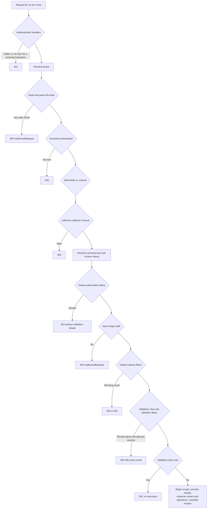

Every command passes through the same stages in the same order, whichever host delivered it. Knowing that order explains why a denied caller never sees rule messages and why `/validate` never touches your handler.

## The stages

| Step | You configure it with | When it fails |
| --- | --- | --- |
| 1. Authentication | `authentication` handlers, or a native principal | 401 |
| 2. Tenant | `tenancy.httpHeader`, `tenancy.sources`, or `tenancy.resolve` | Does not reject by default; `tenancy.required` answers 400 and a membership check 403 |
| 3. Read the input | Nothing | 400 `malformedRequest` |
| 4. Declared authorization | `@roles`, `@authorize`, `@allowAnonymous`, or `authorization` | 403 |
| 5. Bind the input | `@field` declarations, or a Zod `schema` | A wrong shape is held until global authorization finishes, then 400 `malformedRequest` |
| 6. Per-request authorization | `authorize(input, context)` on a successfully bound low-level definition | 403 |
| 7. Resolve context | Scoped context-value providers and key resolvers on valid input | A failure stops execution |
| 8. Global authorization filters | Scoped `AuthorizationCommandFilter` services | 403 for denial; a thrown filter fails closed |
| 9. Global ordinary filters | Scoped `CommandPipelineFilter` services | 400 for validation, 500 for exceptions |
| 10. Validation | Validators, concept validators, then `validate` and per-definition `filters` | 400 with every result collected |
| 11. Execute | Execution scopes, `provide()`, `handle()`, response value handlers, operations | 400, 403, or 500 from the outcome |

## Consequences that are easy to miss

- Global filters short-circuit at the first fragment that remains unsuccessful after severity filtering; existing per-definition callbacks still collect every result.
- `POST <command route>/validate` stops after step 10. `provide()`, `handle()`, and execution scopes never run; execution runners wrap the validation stage.
- Unparseable JSON is rejected in step 3. A parsed body with the wrong shape reaches global authorization before reporting 400. On binding failure `context.command` is raw input, and context value providers and key resolvers do not run. A denial never discloses validation results.
- Step 1 answers 401 only when at least one authentication handler is configured. With none, nobody is authenticated and a protected operation answers 403 in step 4.
- On valid input, context-value providers and key resolvers run before context-aware authorization filters so those filters can inspect the resolved key and values, as in .NET. These providers and resolvers are trusted preparation: they must not make protected business mutations. They are not command `provide()`, which runs only during execution. Do not assume that no application code runs before authorization; declared authorization and the bound `authorize` callback precede preparation, but global authorization filters follow it.
- Filter services are resolved in the operation scope. Validator dependencies are constructed after global filters, including on `/validate`; handler dependencies are constructed only after validation succeeds. A missing dependency reports reason `dependencyUnavailable`.
- A validator that throws produces 400 with reason `validatorFailed` and message `Validation failed`; the exception text is never sent, and the error goes to the configured logger.
- Cancellation is an unconditional admission check before each stage and after each awaited resolution, even after an acknowledged commit: declared authorization and each named policy resolution/invocation, filters, validators, dependency resolution, `provide()`, `handle()`, each response-handler service resolution and invocation, and query `perform()` and `render()`. An in-flight callback is allowed to finish; no later stage starts. A completed command handler's `denied(...)`, `rejected(...)`, or empty result is preserved without starting response handlers, even when unrelated handlers are registered. Ordinary returned values are classified against the actual registered handlers: handled values never become client responses, while a plain value that none handle can be the client response. Cancellation before a matching response handler starts produces a failure with no response, not a successful response containing its unhandled effect. If a response handler has acknowledged an irreversible effect, cancellation after it completes keeps success and the client response only when no later matching handler is waiting. If a later matching handler cannot start, the result has `isSuccess: false`, a cancellation exception, and no `response`; any already acknowledged effect remains committed, and backend recovery/operation-outcome diagnostics remain available. A completed execution runner likewise retains its actual result and diagnostics. Integrations must call `acknowledgeCommandCommit(context)` only after an authoritative acknowledgment (Chronicle does this after the append). Cancellation of the optional Chronicle projection-completion wait after an acknowledged append leaves the append successful with its response; the read model might not yet be updated. A genuine observer failure still fails the command.

## Status codes

The result envelope and status code follow the [Arc HTTP contract](/arc/http-contract/). A result that fails at any step never carries a `response` value. Unless `exposeExceptionDetails` is enabled, exception messages and stack traces are replaced before serialization; the correlation ID stays.

## Related

- [Authorizing commands and queries](../authorizing-commands-and-queries.md)
- [Command outcomes](command-outcomes.md)
- [Query pipeline](../queries/query-pipeline.md)
