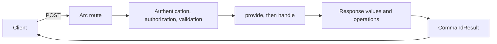

Registering a task or renaming it should not require a hand-written route, body parser, validation response, and status-code mapping per endpoint. In Arc, a command is a class that carries the input and handles itself. Arc supplies the endpoint, the pipeline, the result envelope, and, through the [proxy generator](../proxy-generation/index.md), a typed frontend client.

Arc is a CQRS framework, not an event store. A command's `handle()` can call a service, write through a storage integration, or return a value. It does not have to produce an event or use Chronicle.



## A command

```typescript title="Features/Tasks/Registration/Registration.ts"
import { field } from '@cratis/fundamentals';
import { command } from '@cratis/arc.core';
import { TaskId } from '../TaskId.js';
import { TaskTitle } from '../TaskTitle.js';
import { Tasks } from '../Tasks.js';

@command()
export class RegisterTask {
    @field(TaskId) id!: TaskId;
    @field(TaskTitle) title!: TaskTitle;

    handle(tasks: Tasks): TaskId {
        tasks.register(this.id, this.title);
        return this.id;
    }
}
```

This is the [Tasks sample command](https://github.com/Cratis/Arc.TypeScript/blob/main/Samples/Tasks/Features/Tasks/Registration/Registration.ts). The sample's [generated metadata](../proxy-generation/generated-artifact-metadata.md) binds the `tasks` parameter to the `Tasks` service; without it, mark `handle()` with `@inject(Tasks)`. [Your first command](../getting-started/your-first-command.md) walks through it with its imports.

## Find your way

| Page | Use it when you want to |
| --- | --- |
| [Model-bound commands](model-bound/index.md) | Declare fields, `handle()`, and `provide()`, and control a command's route |
| [Command authorization](model-bound/authorization.md) | Restrict a command with roles, policies, or anonymous access |
| [Command validation](command-validation.md) | Add rules with `CommandValidator` before `handle()` runs |
| [Validation severity filtering](validation-severity-filtering.md) | Let warnings pass or block, per request |
| [Command pipeline](command-pipeline.md) | Understand the order in which every check runs |
| [Command outcomes](command-outcomes.md) | Return a response, reject, or deny from `provide()` and `handle()` |
| [Response value handlers](response-value-handlers.md) | Process extra return values on the server |
| [Command context](command-context.md) | Read the key, values, and request identity; bind the signal and context |
| [Command execution scopes](command-execution-scopes.md) | Run code around `provide()` and `handle()`, such as a unit of work |
| [Command operations](operations/index.md) | Declare side effects that Arc executes and compensates |
| [Command filters](command-filters.md) | Validate low-level definitions with `validate` and `filters` |
| [Low-level definitions](low-level-definitions.md) | Keep Zod-backed `defineCommand` and `defineQuery` |
| [Calling commands from code](calling-commands-from-code.md) | Run a command or query from a job, a spec, or a Fetch API host |

To append events from a command, see the experimental [Chronicle integration](../chronicle/index.md).
