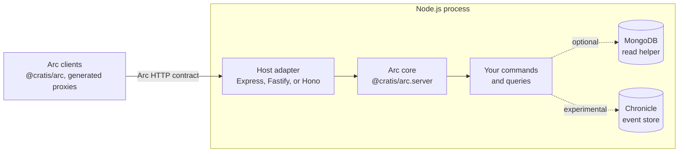

Arc for TypeScript is built so the same command and query code can run behind Express, Fastify, or Hono, with or without a database or an event store. This page explains the boundaries that make that possible and the places where TypeScript forces a different design from Arc on .NET.

:::note[Unpublished source]
Package names are working names, and APIs are not final. For what is supported today, see the [capability reference](../reference/capabilities.md).
:::

## Three layers

- **The core** owns everything that defines Arc behavior: the command and query pipelines, route conventions, result envelopes, validation, authorization, authentication handlers, correlation, and tenancy. It does not import an HTTP framework or a storage driver.
- **A host adapter** translates between one HTTP framework and the core. It routes matching requests to the core, hands over the raw body and a cancellation signal, and writes the response. It adds no Arc behavior of its own.
- **Integrations** give commands and queries somewhere to read and write. They are separate packages that depend on the core, never the other way around. `@cratis/arc.server.mongodb` reads query results from MongoDB. `@cratis/arc.server.chronicle` is an experimental, private package that appends events returned from a command.
- **Client generation** is build-time tooling beside the runtime. The core exports a JSON manifest with `exportClientManifest`, and `@cratis/arc.server.codegen` renders proxies from that JSON. The core does not depend on `@cratis/arc` or on browser code.

Keeping the core framework-independent means a behavior is implemented and tested once, and every adapter inherits it. A difference between adapters is either a limit of the host framework, documented per adapter, or a bug.

## What the core owns and what an adapter owns

| Concern | Core | Host adapter |
| --- | --- | --- |
| Routes and methods | Derives routes from declarations; decides which methods each route accepts | Express and Fastify send only requests whose raw path exactly matches an Arc route; Hono hands every request to the core, which matches the request URL's path. Every other request stays with the application |
| Request bodies and query strings | Enforces the size limit, parses, binds, and validates; turns malformed input into a `malformedRequest` result | Hands the body over unparsed |
| Command and query execution | Runs the pipeline, including authorization before validation | Nothing |
| Results and status codes | Builds the envelope and selects the status code | Writes the status, headers, and body |
| Correlation and tenancy | Resolves the correlation ID and tenant, and makes them available to the running operation | Nothing |
| Authentication and authorization | Runs the configured authentication handlers, then evaluates authorization against the principal | Nothing; a principal from the framework's own authentication is not handed over |
| Cancellation | Passes the signal to every callback as `context.signal` | Express and Fastify abort it when the client disconnects; Hono passes the request's own signal |

Observable queries are not implemented, so neither layer handles server-sent events or WebSocket yet. WebSocket support differs between Express, Fastify, and Hono, so those transports will depend on each adapter.

## The request path

Arc on .NET defines the order in which a request is processed, and the TypeScript core follows it:

1. The adapter receives the request and hands it to the core.
2. The core resolves the correlation ID, runs authentication handlers, and resolves the tenant.
3. Authorization runs first. A denied caller gets 401 or 403 and no validation output, so rule messages never leak to a caller who may not run the operation.
4. Validation runs. `POST <command-route>/validate` stops here and never runs the handler.
5. For a command, execution scopes begin, `provide` and `handle` run, and the scopes complete. For a query, `perform` runs, and an array result is sorted and paged.
6. The core builds the result envelope and selects the status code in the contract's order: 200, then 403, 400, 202, and 500.

A result that fails at any step never carries a response value. Outside development, exception messages and stack traces are replaced before serialization, and the correlation ID stays.

## Idiomatic TypeScript, not a port

Parity means the same observable behavior on the wire, not the same implementation. Several .NET mechanisms have no direct TypeScript equivalent:

| Arc on .NET relies on | Arc for TypeScript |
| --- | --- |
| Attributes and runtime reflection (`[Command]`, `[ReadModel]`, parameter types) | TypeScript types are erased at runtime, so commands and queries are declared explicitly with Zod schemas that describe their inputs |
| Dependency injection with per-request scopes | Explicit typed service tokens and singleton, scoped, or transient registrations. Each operation owns a scope; singleton construction belongs to the registry and receives no request identity. Automatic discovery and .NET container integration are not implemented |
| `AsyncLocal` ambient context | Node.js `AsyncLocalStorage`, with a frozen context per request or direct call, so one request's principal, tenant, or correlation never leaks into another |
| `CancellationToken` | `AbortSignal` |
| `IObservable<T>` and `ISubject<T>` | Not decided. A source that holds a current value is needed to answer an HTTP snapshot with 200 instead of 202 |
| `IQueryable<T>` paging and sorting | In-memory paging and sorting of arrays, or a page the data source already cut, returned with `queryPage` |
| FluentValidation and DataAnnotations | Zod schemas for shape, and validator functions for rules |
| Roslyn analyzers and a proxy generator that reads compiled assemblies | No build-time analyzers. A bounded generator renders proxies from a manifest built from the output shapes you declare in `clientOutput`; it does not read TypeScript types, discover definitions, or cover the full type graph. See [Generate command and query clients](../guides/generate-clients.md) |

Some differences are in the language itself and affect the wire:

- JavaScript numbers are 64-bit floating point. Integers above 2^53 − 1 lose precision unless they travel as strings.
- `undefined` and `null` are different values, and JSON has no `undefined`. Omitted and explicit-null input have to be handled deliberately.
- Dates, times, and GUIDs cross the wire as strings. `@cratis/fundamentals` provides the `DateOnly`, `TimeOnly`, and `Guid` types the generated clients use.
- Node.js runs one event loop per process. A handler that blocks the loop blocks every request.

## Safety choices that differ from Arc on .NET

Where following Arc on .NET exactly would let a remote caller weaken a check, Arc for TypeScript chooses the safer behavior and documents it:

- An HTTP client cannot raise the allowed validation severity to `Error`, so business-rule errors always block. Only trusted code calling `executeCommand` can.
- Tenant and security checks belong in `authorize`, which no severity setting affects.
- A configured tenant resolver is final; there is no silent fallback to a header.
- Unsafe names, paths, body limits, and contradictory authorization declarations stop the server at startup.

The full list is in the [capability reference](../reference/capabilities.md#deliberate-differences).

## Integrations stay outside the core

Arc on .NET adds event sourcing through its Chronicle integration: a command returns events, and they are appended only when the command succeeds. Arc for TypeScript keeps the same boundary. The core never depends on Chronicle, and the experimental integration is a separate package built against the public interfaces of the Chronicle TypeScript client, `@cratis/chronicle`. Namespace, correlation, and event routing are passed explicitly per request. The adapter adds no transaction, command-audit bridge, or observer-completion guarantee; the SDK retains its own auditing behavior. The pinned SDK 6.2.0 does not load in native Node.js, and this adapter remains unverified against a live kernel, so the package stays private and experimental. See [Append Chronicle events from commands](../guides/chronicle.md).

The MongoDB integration follows the same rule: the application owns the client, the tenant-to-database mapping, and the filter, and the package only reads. See [Read models from MongoDB](../guides/mongodb.md).

## Still open

These questions do not have an answer yet. Each one affects behavior a client can observe:

- How commands and queries are discovered: explicit registration only, or build-time generation.
- Whether client generation grows beyond explicit manifests toward the coverage of Arc's .NET proxy generator.
- Which source type observable queries use, and which adapters support WebSocket.
- Broader identity-provider integrations, admission limits, and which SQL tooling a SQL integration builds on.

## Related

- [Arc HTTP contract](/arc/http-contract/)
- [Capability reference](../reference/capabilities.md)
- [Understanding the proxy boundary](/arc/understanding-the-proxy-boundary/)
- [CQRS without event sourcing](/arc/arc-without-event-sourcing/)
