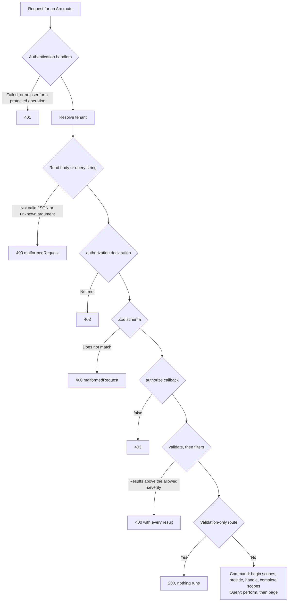

A command that renames a task has to answer several questions before it touches anything: who is calling, may they call this at all, may they change this particular task, is the input well formed, and does it follow the rules? Arc for TypeScript gives each question its own place in a definition and always asks them in the same order, so a caller who may not run an operation never sees its rule messages.

:::note[Unpublished source]
Named policies and schemes are available in the source preview. Model-bound server validators and concept rules are available, but generated client rules are bounded. See [Authorization](../identity/authorization.md) for policy registration and scheme selection. See [Validate model-bound commands and queries](validation.md) and the [capability reference](../reference/capabilities.md).
:::

## A command with every check

This command renames a task. It is an illustration: the bearer tokens are fixed development values, not real token verification.

```typescript title="tasks.ts"
import { ArcServer, AuthenticationStatus, defineCommand, rejected, response, validation } from '@cratis/arc.core';
import type { AuthenticationHandler, CommandFilter } from '@cratis/arc.core';
import { z } from 'zod';

interface Task { id: string; tenant: string; owner: string; title: string }
const tasks = new Map<string, Task>();

// Development only: fixed tokens instead of real token verification.
const developmentUsers = new Map([['ada-dev-token', { id: 'ada', roles: ['editor'] }]]);

const bearerToken: AuthenticationHandler = request => {
    const header = request.headers.get('authorization');
    if (!header?.startsWith('Bearer ')) return { status: AuthenticationStatus.Anonymous };
    const user = developmentUsers.get(header.slice('Bearer '.length));
    if (!user) return { status: AuthenticationStatus.Failed };
    return { status: AuthenticationStatus.Authenticated, principal: { ...user, isAuthenticated: true } };
};

const shortTitle: CommandFilter<{ title: string }> = ({ title }) =>
    title.length <= 200 ? [] : [validation('A title can have at most 200 characters', ['title'])];

const rename = defineCommand({
    name: 'Rename',
    namespace: 'Tasks',
    schema: z.object({ id: z.string(), title: z.string() }),
    authorization: { roles: ['editor'] },
    authorize: ({ id }, context) => {
        if (!context.tenantId) return false;
        const task = tasks.get(id);
        return !task || (task.tenant === context.tenantId && task.owner === context.principal?.id);
    },
    validate: ({ title }) => title.trim() ? [] : [validation('A title is required', ['title'])],
    filters: [shortTitle],
    provide: ({ id }) => {
        const task = tasks.get(id);
        return task ? response(task) : rejected(validation('The task does not exist', ['id'], 'notFound'));
    },
    handle: ({ title }, _context, provided) => {
        const task = provided as Task;
        task.title = title;
        return { id: task.id };
    }
});

export const arc = new ArcServer({ commands: [rename], authentication: [bearerToken] });
```

With one task owned by `ada` in tenant `acme` and one owned by someone else, `POST /api/tasks/rename` answers:

| Request | Status | Why |
| --- | --- | --- |
| No `Authorization` header | 401 | The command requires a role and nobody is authenticated |
| An unknown bearer token | 401 | The handler returned `Failed` |
| Ada's token, no `x-cratis-tenant-id` header | 403 | `authorize` returned `false` |
| Ada's token, tenant `acme`, someone else's task | 403 | `authorize` returned `false` |
| Ada's token, tenant `acme`, a title of spaces | 400 | `validate` returned a result for `title` |
| Ada's token, tenant `acme`, a 300-character title | 400 | The `shortTitle` filter returned a result |
| Ada's token, tenant `acme`, an unknown task ID | 400 | `provide` returned `rejected(...)` with reason `notFound` |
| Ada's token, tenant `acme`, her own task, a new title | 200 | `response` is `{ "id": ... }` |

## The order checks run in



| Step | You configure it with | When it fails |
| --- | --- | --- |
| 1. Authentication | `authentication` handlers on `ArcServer` | 401 |
| 2. Tenant | `tenantHeader` or `resolveTenant` on `ArcServer` | Does not reject; the tenant is `undefined` when none is found |
| 3. Read the input | Nothing; a body for commands and `QUERY`, the query string for GET | 400 `malformedRequest` |
| 4. Declared authorization | `authorization` on the definition | 403 |
| 5. Schema | `schema` on the definition | 400 `malformedRequest` |
| 6. Per-request authorization | `authorize` on the definition | 403 |
| 7. Validation | `validate`, then each entry in `filters` | 400 with every result collected |
| 8. Command: provide and handle | `scopes`, `provide`, `handle` | 400, 403, or 500 from the outcome |
| 8. Query: perform | `perform` | 500 when it throws |

A few consequences are easy to miss:

- All of `validate` and every filter run, and their results are returned together. The first failure does not stop the others.
- `POST <command route>/validate` stops after step 7. `provide`, `handle`, and the scopes never run.
- Unparseable JSON is rejected in step 3, before the role check, so an authenticated caller without the role gets 400 for a malformed body and 403 for a well-formed one. A malformed result carries no rule messages.
- Step 1 answers 401 only when `ArcServer` has at least one authentication handler. With none configured, nobody is authenticated and a protected operation answers 403 in step 4.

Queries follow the same steps with `authorization`, `authorize`, `validate`, and `filters`, then run `perform`. What happens in step 8 for commands is covered in [Decide command outcomes](command-outcomes.md).

## Authenticate callers

An `AuthenticationHandler` receives the Fetch API `Request` and returns one of three results:

| Result | Meaning |
| --- | --- |
| `{ status: AuthenticationStatus.Anonymous }` | This handler does not recognize the request. The next handler runs. |
| `{ status: AuthenticationStatus.Authenticated, principal }` | The caller is known. No further handler runs. |
| `{ status: AuthenticationStatus.Failed }` | The request carried credentials that are wrong. The request ends with 401, whatever the operation requires. |

Handlers run in the order you list them, and they can be `async`. An authenticated principal must have `isAuthenticated: true`, a string `id`, and an array of string `roles`; `name` is optional. Empty strings and large role lists are accepted, as before. Arc preserves other principal fields, copies and freezes the roles and own claim dictionary, and freezes the principal for `context.principal`. There is no authentication-stage size limit on identity fields or membership claims; the encoded identity **display cookie** has a separate 4096-byte limit. By default, the Express, Fastify, and Hono adapters do not pass on a user that the framework's own middleware authenticated: verify credentials in an Arc handler. To bridge an already verified host principal explicitly, set `nativePrincipal: true` and provide a trusted adapter callback; you cannot combine this mode with Arc authentication handlers. See [Host Arc in Express, Fastify, or Hono](host-integration.md#adapter-differences-and-limitations).

## Restrict who can run an operation

| Declaration | Who may call |
| --- | --- |
| None | Everyone, including anonymous callers |
| `{ authenticated: true }` | Any authenticated caller |
| `{ roles: ['editor', 'admin'] }` | An authenticated caller with at least one of the roles |
| `{ anonymous: true }` | Everyone; `authorize` still runs |
| `{ policy: 'Finance', authenticated: true }` | A verified principal accepted by the registered async policy |
| `{ schemes: ['Verified'], authenticated: true }` | A principal authenticated by the named handler |

Combining `anonymous: true` with `authenticated`, `roles`, `policy`, or `schemes` is a contradiction, and the `ArcServer` constructor throws. Model-bound `@roles('editor', 'admin')` allows either role within that declaration; stacked decorators on one class or query method are separate requirements and **all** must pass. A `@query()` method's authorization replaces the read-model class declaration. Authorization on a command's `handle()` or a static method without `@query()` fails at build time rather than silently leaving the endpoint open.

When the answer depends on the input, the tenant, or stored data, add `authorize(input, context)`. It runs after the schema, receives the typed input, and returns `true` or `false`, or a promise of either. `false` answers 403 without a reason. Put every security and tenant check here, not in a validator: nothing a caller sends, and no allowed severity, changes the outcome of `authorize`.

## Put shape in the schema and rules in validators

This section describes the low-level `defineCommand`/`defineQuery` path. For `@command()` and `@readModel()` classes, use [model-bound server validators](validation.md) instead; the same authorization and severity order applies.

| Put it in the Zod schema | Put it in `validate` or `filters` |
| --- | --- |
| Types, required and optional properties, defaults | Business rules a user can fix, with a message and the member it concerns |
| Anything where a failure means the client sent the wrong shape | Rules that need data or the principal |

A schema failure produces exactly one result with the reason `malformedRequest`, no message a user can act on, and no members. That includes Zod refinements such as `z.string().min(3)`. If a client should show "A title is required" next to the title field, return it from a validator.

`validation(message, members?, reason?, severity?)` defaults to no members, the reason `rule`, and `Severity.Error`. A validator may return an array, nothing, or a promise of either. A filter has the same shape as `validate`, and `filters` takes a list, so one filter can be shared by many operations. For queries, the type is `QueryFilter`.

If a validator throws, the caller gets 400 with one result: reason `validatorFailed`, message `Validation failed`, and no members. The exception text is never sent; the original error goes to the `logger` option. When the request was already cancelled, the failure is reported as an exception instead, not as a rule.

:::caution[Schemas must convert to JSON Schema]
Arc converts every schema to JSON Schema when you construct `ArcServer`. Types without a JSON representation, such as `z.date()` and `.transform(...)`, make the constructor throw. Send dates as ISO strings with `z.iso.datetime()` and convert them in the handler.
:::

## Choose how strict warnings are

Each validation result has a severity: `Unknown` (0), `Information` (1), `Warning` (2), or `Error` (3). Results at or below the allowed severity are removed and do not block. Results above it block the operation and are returned. The default is `Warning`, so only errors block, and warnings and information are not returned.

| Caller | Allowed severity |
| --- | --- |
| HTTP command | `X-Allowed-Severity` of `0`, `1`, or `2`. A missing or invalid value means `2`. A value of `3` is capped to `2`, so errors always block. |
| HTTP query | Always `Warning`; the header is ignored |
| `executeCommand` | `context.allowedSeverity` as given, including `Error` |
| `performQuery` | Always `Warning` |

A client that sends `X-Allowed-Severity: 1` makes warnings block and sees them. The cap on `3` is a deliberate difference from Arc on .NET 22.22.0, which accepts `3` and runs a command whose only problems are errors. Results passed to `rejected(...)` in `provide` or `handle` are filtered the same way.

## Related

- [Identity and authentication](../identity/index.md) and [authorization policies](../identity/authorization.md) for verified credentials, named rules, and scheme selection.
- [Decide command outcomes](command-outcomes.md) for `provide`, `handle`, and execution scopes.
- [Bind query arguments, page, and sort](queries.md) for how input reaches a query.
- [Configure the server](configuration.md) for tenants, error logging, and development mode.
- [Arc HTTP contract](/arc/http-contract/) for the result envelope and status codes.
