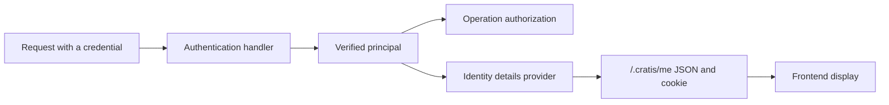

Ada signs in to your task application. The header should say "Hello, Ada", the Archive button should only appear for editors, and the page should know which customer she is working for. Without help you end up writing a `/me` route, repeating the role list in the frontend, and deciding by hand what the browser may cache.

Arc gives you one endpoint for that job. You write a small provider that turns the authenticated caller into the details your UI needs. Arc serves the result at `GET /.cratis/me` and sets a cookie that the published `@cratis/arc` client reads, so every component can ask "who is this?" without another request.

## Three jobs, three places

Identity details sit next to two other concerns. Keep them apart, because each one trusts different evidence:

| Job | Question | Where it lives |
| --- | --- | --- |
| Authentication | Who is calling? | [Authentication handlers](../core/authentication.md) or a [native principal](../hosts/native-principal.md) |
| Authorization | May this caller run this command or query? | [Decorators and policies](../core/authorization.md) on each operation |
| Identity details | What should the UI show about this caller? | An identity details provider, served at `/.cratis/me` |



The provider only ever sees a principal that authentication already verified. Nothing it returns flows back into authorization.

## Provide identity details

Write a provider class and let discovery find it, or add it with `builder.add(...)`:

```typescript title="Features/Identity/GreetingDetails.ts"
import { field } from '@cratis/fundamentals';
import {
    identityDetailsProvider,
    type ExecutionContext, type IdentityDetailsProvider, type Principal
} from '@cratis/arc.core';

export class UserDetails {
    @field(String) greeting!: string;
}

@identityDetailsProvider()
export class GreetingDetails implements IdentityDetailsProvider {
    readonly detailsType = UserDetails;

    provide(principal: Principal, context: ExecutionContext): UserDetails {
        return { greeting: `Hello ${principal.name ?? principal.id} (${context.tenantId ?? 'no tenant'})` };
    }
}
```

`detailsType` tells Arc the shape of the details, so it can validate what `provide` returns, describe it at `/.cratis/identity-details/schema`, and let the [proxy generator](../proxy-generation/index.md) emit a matching frontend class.

With an [authentication handler](../core/authentication.md) that recognizes Ada and a request for tenant `acme`, `GET /.cratis/me` answers:

```json
{"id":"ada","name":"Ada","isAuthenticated":true,"isAuthorized":true,"roles":["Editor"],"details":{"greeting":"Hello Ada (acme)"}}
```

The same response sets `.cratis-identity=<base64>; Path=/; SameSite=Lax`. The `id`, `name`, and `roles` come from the verified principal. Only `details` comes from your provider, and Arc runs it again on every call to `/.cratis/me`.

:::danger[The identity cookie is not a credential]
`.cratis-identity` is unsigned and readable by JavaScript. It exists so the frontend can display the user. Never use it to authenticate or authorize anything; Arc itself never reads it.
:::

## What you have so far

- Authentication decides who the caller is. Your provider only adds display details.
- `/.cratis/me` returns the principal plus those details, and caches them in a cookie for the frontend.
- Commands and queries keep their own authorization. Hiding a button in the UI protects nothing.

## Go further

| Topic | What it covers |
| --- | --- |
| [How identity details are served](provider-flow.md) | Registration choices, every `/.cratis/me` answer, the cookie format, and how caching works |
| [Show identity in a React frontend](frontend.md) | `useIdentity`, `RequireRole`, typed details, and refreshing after a change |
| [Identity across services](topologies.md) | One service, several services behind a gateway, or a dedicated identity service |
| [Simulate a signed-in user locally](local-development.md) | Try different users, roles, and tenants on a loopback development host |
| [Development users and tenants](development-users-and-tenants.md) | Fixture lists for local user and tenant pickers |

Next, read [how identity details are served](provider-flow.md) to see what happens between the request and the cookie.
