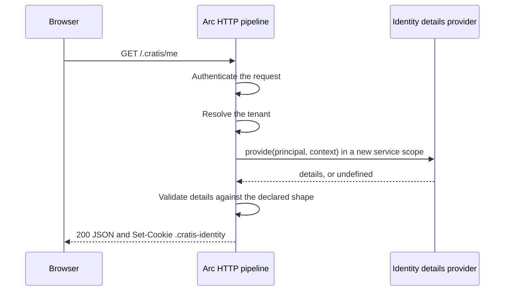

Once a provider exists, three questions follow quickly. How does Arc find it? What does the browser get back when something goes wrong? And if the cookie caches the identity, when does a change in your data reach the screen? This page follows one request through `/.cratis/me` and answers each.

## Follow one request



Authentication and tenant resolution run exactly as they do for a command or query. An anonymous caller never reaches the provider. The provider runs inside the request's execution context, so `currentContext()` returns the same principal and tenant it receives as arguments.

## Register the provider

Choose one registration:

- **A decorated class.** Mark it `@identityDetailsProvider()` and add it with `builder.add(...)` or let `builder.discover(...)` find it. Arc constructs a new instance for every request, so its constructor must take no arguments.
- **An option object.** Pass `identityDetails: { detailsType, provide }` or `identityDetails: { schema, provide }` to `ArcApplication.createBuilder(...)`. The explicit option wins, and cannot be combined with a discovered provider.

Two discovered providers without an explicit option fail at `build()`.

The provider declares the shape of its details either as `detailsType`, a class with `@field` declarations, or as a Zod `schema`. Prefer `detailsType`: the [proxy generator](../proxy-generation/index.md) turns it into a frontend class you can pass to `useIdentity`.

## Reach your own services

Because the class has no constructor injection, resolve collaborators from the request's service scope inside `provide`:

```typescript title="Features/Identity/DirectoryDetails.ts"
import { field } from '@cratis/fundamentals';
import { currentServices, identityDetailsProvider, type IdentityDetailsProvider, type Principal } from '@cratis/arc.core';
import { Directory } from './Directory.js';

export class ProfileDetails {
    @field(String) displayName!: string;
}

@identityDetailsProvider()
export class DirectoryDetails implements IdentityDetailsProvider {
    readonly detailsType = ProfileDetails;

    async provide(principal: Principal): Promise<ProfileDetails> {
        const directory = await currentServices().resolve(Directory);
        return { displayName: directory.displayNameFor(principal) };
    }
}
```

`Directory` is your own service, registered with `builder.services.addScoped(Directory, ...)`. Arc disposes the scope after the provider finishes, also when it denies or fails.

To keep someone out of the application, return `undefined`. Arc answers 403 for that caller. This decision controls `/.cratis/me` only: commands and queries still need their own [authorization](../core/authorization.md).

## Every answer from /.cratis/me

| Situation | `GET /.cratis/me` |
| --- | --- |
| No provider configured | Not mapped |
| Anonymous caller | 401 |
| The authentication handler rejected the credential | 401 |
| Tenant resolution fails: missing with `tenancy.required`, or not a member under `tenancy.membershipClaim` | 400 or 403 |
| `provide` returns `undefined` | 403 |
| `provide` throws or rejects, the details do not match the declared shape, or the encoded cookie would exceed 4096 bytes | Generic 500, no cookie |
| Otherwise | 200 with the identity JSON and the cookie |

Every answer carries `Cache-Control: no-store`. `GET /.cratis/identity-details/schema` returns the JSON Schema of `details`; see [Identity details schema](../introspection/identity-details-schema.md).

## The cookie Arc sets

A 200 answer sets `.cratis-identity=<base64>; Path=/; SameSite=Lax`, adding `Secure` when the trusted transport is HTTPS. The value is the same JSON as the response body, Base64-encoded. It is not `HttpOnly`, because the frontend reads it.

The JSON response keeps Unicode. The cookie escapes non-ASCII characters before encoding, so the client's `JSON.parse(atob(cookie))` recovers names and details, including emoji. Cookie bytes are not guaranteed to match .NET's JSON escaping.

Keep details small. A cookie over 4096 bytes fails the request instead of being truncated, and anything you put in details is readable by any script on the page. Leave out tokens, secrets, and personal data the UI does not show.

## Where identity is cached

The server never reads `.cratis-identity`. Every call to `/.cratis/me` authenticates the request and runs your provider again.

Caching happens in the browser. The published client's identity provider reads the cookie first and only calls `/.cratis/me` when the cookie is missing or when you ask it to refresh. That has two consequences:

- **Details can be stale.** When roles or details change on the server, the UI keeps showing the cached values until the frontend refreshes. See [refresh after a change](frontend.md#refresh-after-a-change).
- **A forged cookie changes only the display.** Anyone can edit the cookie in their own browser. Every command and query still authorizes against the principal authentication produced, so the edit can show a button but never run the operation behind it.

Arc on .NET differs here. Its `/.cratis/me` endpoint accepts a nonempty identity cookie before it consults the provider, and it has an `IIdentityProvider` service with `ModifyDetails`. Arc for TypeScript has neither. To store a user preference, send a command and keep the value in your own storage; the next refresh returns it through the provider.

## Recap

- Register one provider, as a decorated class or as the `identityDetails` option.
- Resolve services inside `provide`, and return `undefined` to answer 403.
- Treat the cookie as a display cache owned by the browser. Arc never trusts it.

Next, [show identity in a React frontend](frontend.md).
