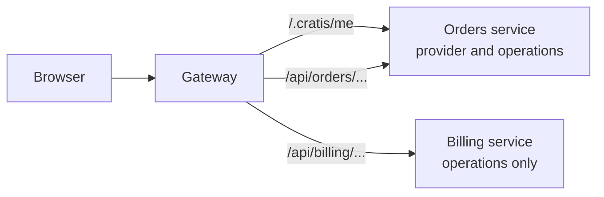
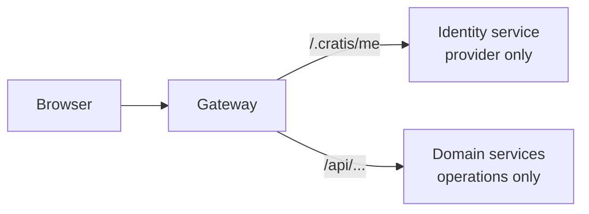

A single Node service is simple: it authenticates the caller, serves `/.cratis/me`, and runs every command. As the system grows into an orders service, a billing service, and a gateway in front of them, the question changes. Which service answers "who is this?", and how does each service know the caller is real?

Arc does not coordinate identity between services. Each Arc application authenticates its own requests and, if you give it a provider, serves its own `/.cratis/me`. The choice of topology is yours. The rules below keep it safe whichever one you pick.

## The rules that hold in every topology

- **Every service verifies the caller itself.** Configure authentication in each Arc application, for example [`jwtBearer()`](../core/authentication.md#verify-jwt-bearer-tokens) with the same issuer and audience everywhere, or a host-verified [native principal](../hosts/native-principal.md). A request that passed the gateway is not proof on its own.
- **Every service authorizes its own operations.** Roles and policies belong on the commands and queries of the service that owns them.
- **The identity cookie never crosses a trust boundary as evidence.** `.cratis-identity` is display data the browser can edit. Never forward it to another service to say who the caller is. Forward the real credential, such as the bearer token.

## One service

Put the identity details provider in the service. This is the default and needs nothing beyond [Identity](index.md).

## Several services behind a gateway

The frontend talks to one origin, so it expects one `/.cratis/me`. Give exactly one service the provider and route `/.cratis/me` to it. The other services register no provider, so they do not map that route at all.

Each service still maps its own `/.cratis/commands`, `/.cratis/queries`, and observable query routes under `/.cratis`. Route those per service, or keep them internal, instead of sending the whole `/.cratis` prefix to one backend.

When the details need data owned by another service, fetch it inside `provide` and pass along the caller's real credential. Arc does not merge details from several services for you.

## A dedicated identity service

When several teams need a say in what the UI shows about a user, a small Arc application can own only the provider. It authenticates like the rest, answers `/.cratis/me`, and has no commands of its own. Keep its details small: the cookie it sets must stay under 4096 bytes, or `/.cratis/me` fails.

## Which one to choose

| Situation | Topology |
| --- | --- |
| One backend, or a frontend per backend | One service |
| Several backends behind one origin, with details owned by one of them | Gateway, provider in the owning service |
| Details assembled from several domains, or owned by a platform team | Dedicated identity service |

Whatever you choose, test it end to end: an anonymous request, a forged `.cratis-identity` cookie, and a request that skips the gateway must all fail at the service that owns the operation.

Next, [simulate a signed-in user locally](local-development.md) to exercise these rules without a real identity provider.
