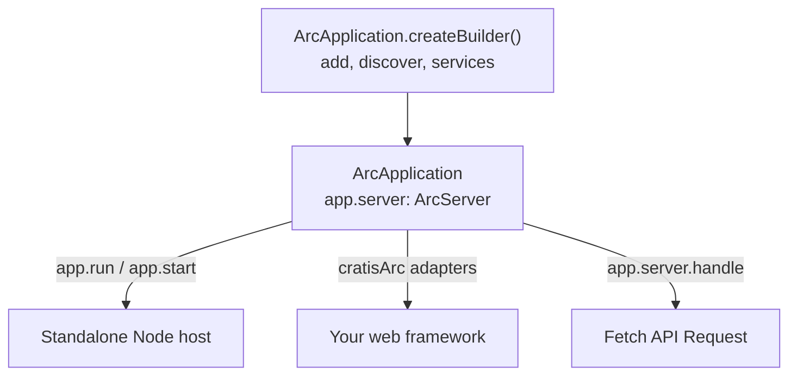

You have written a command and a read model, and now something has to listen on a port. Maybe your team already runs Express, or you want nothing between Arc and Node's own HTTP server. Arc for TypeScript keeps those decisions apart: **the core owns the application model**, and **the host only delivers requests to it**. Your commands, queries, validators, and services do not change when you change host.

## Choose the host

| Host | Package and entry point | Use it when |
| --- | --- | --- |
| Standalone Node host | `@cratis/arc.core`: `app.run()` or `app.start()` | You want Arc routes, and optionally a built frontend, on one port with no web framework |
| Your own Node server | `@cratis/arc.core`: `createArcNodeHandler(server)` | You already own a `node:http` or `node:https` server and want Arc as its request handler |
| Express 5 | `@cratis/arc.express`: `app.use(cratisArc(arcApp))` | Your application already uses Express middleware and routes |
| Fastify 5 | `@cratis/arc.fastify`: `app.register(cratisArc, { arc: arcApp })` | Your application already uses Fastify plugins and hooks |
| Hono 4 | `@cratis/arc.hono`: `app.use(cratisArc(arcApp))` | Your application already uses Hono, on Node through `@hono/node-server` |
| Any Fetch API host or none | `@cratis/arc.core`: `server.handle(request)` | You call Arc from a spec, a job, or a runtime that speaks `Request` and `Response` |

Every host runs the same pipeline: authentication, tenant resolution, authorization, validation, then your code. A difference between hosts is either a limit of the host framework, documented on its page, or a bug.

## What the host owns and what it does not

The host owns the listener, TLS, and shutdown order. Arc owns routes, body parsing, the result envelope, status codes, correlation, and cancellation of `context.signal` when a client disconnects. Adapters hand Arc the raw body, so an adapter must be mounted before any body parser that would consume it. [Host adapters](hosts/index.md) lists what each adapter does with paths and bodies.

Observable queries add one more concern: WebSocket upgrades. The standalone host handles them itself; each framework adapter has a separate mount call because Express, Fastify, and Hono accept upgrades differently. See [WebSockets](hosts/websockets.md).

## Then choose storage and client output

Arc does not require a database or an event store. A command can call your own service, write to storage through an optional integration, or return a response. Add what the application needs:

- [MongoDB](mongodb/index.md) for tenant-scoped collections with change-stream observation.
- [SQL with Drizzle](sql/index.md) for tenant-scoped SQLite and PostgreSQL reads.
- [Chronicle](chronicle/index.md), experimental, when commands should append events.

[Proxy generation](proxy-generation/index.md) is a separate build step. It reads your TypeScript source and writes typed clients for the published `@cratis/arc` frontend runtime; it never queries a running server.

## Continue

- [Arc.Core](core/index.md): the standalone Node host, its listener options, and shutdown.
- [Build an application](core/getting-started.md): the builder, discovery, and explicit catalogs.
- [Host adapters](hosts/index.md): Express, Fastify, and Hono.
- [Configuration](configuration/index.md): every option the builder and server accept.
