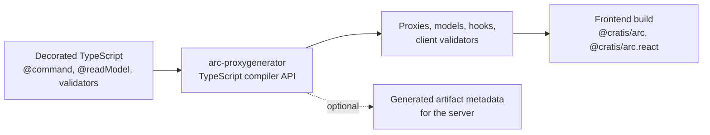

A frontend that calls your commands and queries through hand-written `fetch` calls drifts from the server the first time someone renames a field. The route changes, a required property becomes optional, and nothing fails until a user clicks the button.

`arc-proxygenerator` removes that drift. It reads your TypeScript project and writes typed proxies for the published `@cratis/arc` client: command and query classes, React hooks, models, and the client-safe part of your validators, all with the routes the server serves. Rename a field on the server, regenerate, and the frontend compiler shows you every place that needs to change.

:::caution[Source preview]
`@cratis/arc.proxygenerator` is not published to npm. Run its CLI from a clone of this repository after `yarn build`, or install a packed tarball in your own project, as [Create an application](../getting-started/create-an-application.md) shows.
:::

## How it works

The generator reads source through the TypeScript compiler API. It never imports or runs your application, and it never talks to a running server. That makes it safe to run in CI and in watch mode, and it means everything it knows comes from your declarations: decorators, `@field` types, return types, and validator rules.

It walks the artifacts folder with the same rules as `builder.discover()`, so `for_*` and `given` folders and `index.ts` files are skipped there too. Route options such as `--api-prefix` and `--segments-to-skip` must match the server's [endpoint mapping](../core/endpoint-mapping.md), because the generator cannot ask the server which routes it chose.

## What you receive

- **Commands**: a class per command with typed properties, `execute()`, the route, client-side validation, and a React `use()` hook.
- **Queries**: a class per query method, snapshot or observable, with a parameters interface when the query takes arguments, sort helpers, and React hooks including paging.
- **Models**: classes with `@field` metadata, so the client can turn JSON into `Guid` values, dates, and nested models. A concept arrives as its underlying type.
- **Identity details**: the `detailsType` of an [identity details provider](../identity/provider-flow.md), ready for `useIdentity`.
- **Barrels**: an `index.ts` per folder, unless you turn them off.
- **Server metadata**, optionally: with `--metadata`, a module the server registers with `useGeneratedMetadata` to infer service and argument bindings. See [Generated artifact metadata](generated-artifact-metadata.md).

[What the generator writes](generated-code.md) shows each of these for the Library sample.

## Compatibility

The generated proxies target `@cratis/arc` and `@cratis/arc.react` 22.19.1 with `@cratis/fundamentals`, compiled in strict `Bundler` mode with `skipLibCheck: false`.

Imports between generated files are extensionless by default, which suits Vite and other bundlers. Use `--js-import-specifiers` for native Node ESM after compilation. `NodeNext` consumer compilation is not supported with the published client declarations.

## Limits

The analyzer keys generated models by namespace and class name, so two `Item` models in separate folders produce separate files, and generated references use aliased imports if those names collide in one file. An exported class marked `@identityDetailsProvider()` contributes its `detailsType` or concrete `provide()` result model without an HTTP endpoint. Source-only identity provider configuration outside the artifacts root is not analyzed.

For client preferences, `@command({ treatWarningsAsErrors: true })` emits the command flag. `@query({ httpMethod: QueryHttpMethod.Query, treatWarningsAsErrors: true })` emits `setHttpMethod(QueryHttpMethod.Query)` and the query flag; import the enum from `@cratis/arc.core`. `Get` and `Auto` are also supported. These settings affect the generated client, not the server's acceptance of requests. The HTTP server still caps `X-Allowed-Severity` at Warning. Dynamic decorator options cannot be emitted safely and fail generation.

The output does not reproduce the .NET generator's templates byte for byte: the file header and import layout differ. Nullable command types and interface-only model mode compile, but have not been compared against a live client. The [capability reference](../reference/capabilities.md#proxies-introspection-and-tooling) tracks what is verified.

## Choose your next step

1. [Set up proxy generation](getting-started.md) for your backend and a dedicated frontend folder.
2. [Use the proxies in React](frontend-usage.md): commands, queries, paging, and live updates.
3. Look up [what the generator writes](generated-code.md), [type mapping](type-mapping.md), and [validation rules](validation.md).
4. Adjust [configuration](configuration.md) when your routes or folder layout differ from the defaults.

For specialized output, see [generated artifact metadata](generated-artifact-metadata.md), [file index tracking](file-index-tracking.md), and the [low-level manifest](low-level-manifest.md) for `defineCommand` and `defineQuery`.
