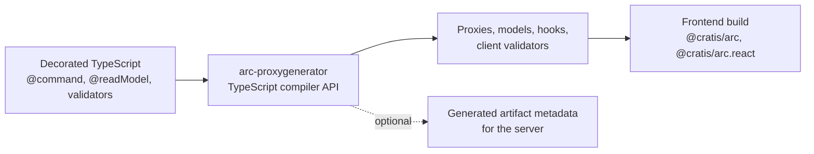

A frontend that calls your commands and queries through hand-written `fetch` calls drifts from the server the first time someone renames a field. The route changes, a required property becomes optional, and nothing fails until a user clicks the button.

`arc-proxygenerator` removes that drift. It reads your TypeScript project and writes typed proxies for the published `@cratis/arc` client: command and query classes, React hooks, models, and the client-safe part of your validators, all with the routes the server serves. Rename a field on the server, regenerate, and the frontend compiler shows you every place that needs to change.

:::caution[Source preview]
`@cratis/arc.proxygenerator` is not published to npm. Run its CLI from a clone of this repository after `yarn build`, or install a packed tarball in your own project, as [Create an application](../getting-started/create-an-application.md) shows.
:::

## How it works

```mermaid
flowchart LR
    Source["Decorated TypeScript<br/>@command, @readModel, validators"] --> Analyzer["arc-proxygenerator<br/>TypeScript compiler API"]
    Analyzer --> Proxies["Proxies, models, hooks,<br/>client validators"]
    Proxies --> Frontend["Frontend build<br/>@cratis/arc, @cratis/arc.react"]
    Analyzer -. optional .-> Metadata["Generated artifact metadata<br/>for the server"]
```

The generator reads source through the TypeScript compiler API. It never imports or runs your application, and it never talks to a running server. That makes it safe to run in CI and in watch mode, and it means everything it knows comes from your declarations: decorators, `@field` types, return types, and validator rules.

It walks the artifacts folder with the same rules as `builder.discover()`, so `for_*` and `given` folders, `index.ts`, and `*.proxy.ts` files are skipped there too. Route options such as `--api-prefix` and `--segments-to-skip` must match the server's [endpoint mapping](../core/endpoint-mapping.md), because the generator cannot ask the server which routes it chose.

## What you receive

- **Commands**: a class per command with typed properties, `execute()`, the route, client-side validation, and a React `use()` hook.
- **Queries**: a class per query method, snapshot or observable, with a parameters interface when the query takes arguments, sort helpers, and React hooks including paging.
- **Models**: classes with `@field` metadata, so the client can turn JSON into `Guid` values, dates, and nested models. A concept arrives as its underlying type.
- **Identity details**: the `detailsType` of an [identity details provider](../identity/provider-flow.md), ready for `useIdentity`.
- **Barrels for separate output**: an `index.ts` per folder by default when proxies go to a dedicated output folder. Co-located output skips generated barrels.
- **Server metadata**, optionally: with `--metadata`, a module the server registers with `useGeneratedMetadata` to infer service and argument bindings. See [Generated artifact metadata](generated-artifact-metadata.md).

[What the generator writes](generated-code.md) shows each of these for the Library sample.

## Compatibility

The generated proxies target `@cratis/arc` and `@cratis/arc.react` 22.45.0 with `@cratis/fundamentals`, compiled in strict `Bundler` mode with `skipLibCheck: false`.

Imports between generated files are extensionless by default, which suits Vite and other bundlers. Use `--js-import-specifiers` for native Node ESM after compilation. `NodeNext` consumer compilation is not supported with the published client declarations.

### Comparison with .NET 22.45.0

The repository's [paired-generator comparison](https://github.com/Cratis/Arc.TypeScript/tree/main/ContractTests/ProxyComparison) captures actual `Cratis.Arc.ProxyGenerator.Build` 22.45.0 output for equivalent command, snapshot-query, observable-query, nested/derived model, enum and validation fixtures. Both outputs compile against the pinned browser client and exercise routes, descriptors, hydration, validation and hook signatures.

This is a compatibility check, not a byte-equality promise. Intentional differences include type-only imports, source enum member names (rather than .NET's camel-cased names), formatting and provenance. The pinned .NET model-bound generator's query-parameter sorting helpers are a [known defect](https://github.com/Cratis/Arc/issues/2998), not an intentional API difference: TypeScript follows the documented contract that `sortBy` names a read-model field.

TypeScript retains but deprecates `sortBy` helpers for record, nested-model, array, map, and polymorphic fields until the [next major release](https://github.com/Cratis/Arc.TypeScript/blob/main/decisions/0004-defer-generated-proxy-removals-to-the-next-major-release.md): in-memory sorting rejects them, database providers apply their own ordering, and you should sort on a scalar field instead; scalar helpers (string, number, boolean, Date, Guid, DateOnly, TimeOnly, TimeSpan, enums, and concepts over those) are unchanged.

The inventory separates intentional differences, known defects and known limitations. Regeneration rejects unreviewed bytes, normalizing only the generated header's timestamp; offline checks also reject changed C# fixture or .NET option fingerprints. See the [contract-test guide](https://github.com/Cratis/Arc.TypeScript/blob/main/ContractTests/README.md#compare-proxy-generators) for the inventory, behavioral sorting checks and recapture instructions.

## Limits

The analyzer keys generated models by namespace and class name, so two `Item` models in separate folders produce separate files, and generated references use aliased imports if those names collide in one file. An exported class marked `@identityDetailsProvider()` contributes its `detailsType` or concrete `provide()` result model without an HTTP endpoint. Source-only identity provider configuration outside the artifacts root is not analyzed.

For client preferences, `@command({ treatWarningsAsErrors: true })` emits the command flag. `@query({ httpMethod: QueryHttpMethod.Query, treatWarningsAsErrors: true })` emits `setHttpMethod(QueryHttpMethod.Query)` and the query flag; import the enum from `@cratis/arc.core`. `Get` and `Auto` are also supported. These settings affect the generated client, not the server's acceptance of requests. The HTTP server still caps `X-Allowed-Severity` at Warning. Dynamic decorator options cannot be emitted safely and fail generation.

The output does not reproduce the .NET generator's templates byte for byte: the file header and import layout differ. Nullable command types and interface-only model mode compile, but have not been compared against a live client. The [capability reference](../reference/capabilities.md#proxies-introspection-and-tooling) tracks what is verified.

## Choose your next step

1. [Set up proxy generation](getting-started.md) with proxies beside your backend slices; a separate frontend output folder remains an option.
2. [Use the proxies in React](frontend-usage.md): commands, queries, paging, and live updates.
3. Look up [what the generator writes](generated-code.md), [type mapping](type-mapping.md), and [validation rules](validation.md).
4. Adjust [configuration](configuration.md) when your routes or folder layout differ from the defaults.

For specialized output, see [generated artifact metadata](generated-artifact-metadata.md), [file index tracking](file-index-tracking.md), and the [low-level manifest](low-level-manifest.md) for `defineCommand` and `defineQuery`.
