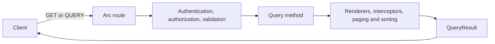

A frontend needs lists, lookups, and live views, and each one normally means a route, argument parsing, paging code, and a response shape to keep in step with the client. In Arc, a query is a static method on a read model. Arc supplies the route, binds the arguments, pages and sorts the result, and, for a live query, streams updates to every subscriber.



## A query

```typescript
@readModel()
export class TaskItem {
    @field(TaskId) id!: TaskId;
    @field(TaskTitle) title!: TaskTitle;

    @query(service(Tasks))
    static allTasks(tasks: Tasks): TaskItem[] { return tasks.all(); }
}
```

This excerpt is from the [Tasks sample read model](https://github.com/Cratis/Arc.TypeScript/blob/main/Samples/Tasks/Features/Tasks/Listing/Listing.ts). `GET /api/tasks/listing/all-tasks` answers with a query result whose `data` holds the tasks.

A read model here is a class describing the shape of what you return. Where the data comes from is your choice: an in-memory service, [MongoDB](../mongodb/index.md), [SQL with Drizzle](../sql/index.md), or a Chronicle projection.

## Find your way

| Page | Use it when you want to |
| --- | --- |
| [Model-bound queries](model-bound/index.md) | Declare read models, query methods, and their parameters |
| [Query arguments](model-bound/query-arguments.md) | Bind named, optional, and repeated arguments from the query string |
| [Paging and sorting](model-bound/paging.md) | Page and sort in memory, or return a page your data source cut |
| [Query validation](validation.md) | Validate arguments together with `QueryValidator` |
| [Query pipeline](query-pipeline.md) | Understand the order of checks and result processing |
| [Using the HTTP QUERY method](using-the-http-query-method.md) | Send structured arguments in a body |
| [Observable queries](observable-queries.md) | Serve a snapshot and live updates from the same route |
| [Subscribe to an observable query](subscribing-to-observable-queries.md) | Receive updates over SSE, a WebSocket, or the `@cratis/arc` client |
| [Multiplexed observable queries](observable-query-demultiplexer.md) | Share one WebSocket or SSE connection across many subscriptions |
| [Observable emission guards](observable-query-emission-guards.md) | Re-check access for every emission |
| [Query health](query-health.md) | Inspect the caller's own hub connections |
| [Using observable queries with curl](using-observable-queries-with-curl.md) | Explore a live query from a terminal |
| [Query renderers](renderers.md) | Turn a provider-owned value into data or a page |
| [Read-model interception](read-model-interception.md) | Transform read-model instances before they reach the wire |
