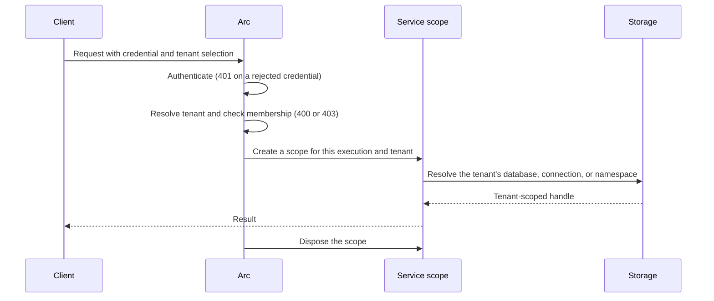

Acme and Globex share your task service. A request from Ada at Acme has to reach Acme's tasks, a request that names Globex without belonging to it has to stop before any code runs, and a background import has to know which tenant it writes for. This guide wires those three steps together and shows where each one happens.

You need an Arc application with authentication configured; see [Authentication](../core/authentication.md). The storage sections assume the matching integration is registered as its getting-started page shows.

## 1. Choose how a request selects its tenant

Selection answers "which tenant does this request name?". Pick the source that matches how callers reach you:

| Source | Use it when | Configuration |
| --- | --- | --- |
| `header` | A trusted gateway or internal caller sets the tenant | `httpHeader`, default `x-cratis-tenant-id` |
| `claim` | Your identity provider puts the tenant in the token | `claimType`, default `tenant_id` |
| `subdomain` | Customers reach you at `acme.example.com` | `baseDomain`, and a host-verified authority from the adapter |
| `fixed` | The deployment serves one tenant | `fixedTenantId` |

`tenancy.sources` tries sources in order and takes the first nonempty answer. [Tenant resolvers](resolvers.md) lists every option and validation rule.

A header, query string, or subdomain value is what the caller **asks for**. It says nothing about whether the caller may have it. A claim comes from a verified principal, but it is still only a selection until you check membership.

## 2. Verify membership

Membership answers "may this caller use the tenant it selected?". Configure it next to the sources:

```typescript title="main.ts"
import { ArcApplication, jwtBearer, TenantResolverType } from '@cratis/arc.core';

const builder = ArcApplication.createBuilder({
    authentication: [jwtBearer({
        jwksUrl: new URL('https://login.example.com/.well-known/jwks.json'),
        issuer: 'https://login.example.com/',
        audience: 'tasks-api',
        algorithms: ['RS256']
    })],
    tenancy: {
        sources: [TenantResolverType.Claim, TenantResolverType.Header],
        claimType: 'tenant_id',
        membershipClaim: 'tenants',
        required: true
    }
});
const app = await builder.build();
await app.run();
```

For each request, Arc authenticates the bearer token, then:

- takes the token's `tenant_id` claim, or the `x-cratis-tenant-id` header when the token has none;
- answers **400** when neither is present, because `required` is set;
- answers **403** when the selected tenant is not in the token's comma-separated `tenants` claim.

A token for Ada with `"tenants": "acme"` and no `tenant_id` claim can send `x-cratis-tenant-id: acme`, and gets 403 for `globex`. When the token carries `tenant_id`, the claim comes first and selects the tenant, whatever the header says. Both checks run before authorization, validation, and your code.

When the rule is more than a claim lookup, write `tenancy.resolve(request, principal)` instead. Its answer is final: Arc does not apply `sources`, `required`, or `membershipClaim` to it, and does not lowercase it. Check membership inside it, derive the tenant from the principal, and return lowercase IDs.

:::caution[Selection is not membership]
Without `membershipClaim` or a checking `tenancy.resolve`, a header selects any tenant the caller names. A separate database per tenant does not help: Arc routes the request to the database the caller named. Never check membership in a validator, because a trusted direct caller can lower the blocking severity.
:::

## 3. Read the tenant's data

The resolved tenant becomes `context.tenantId`. Every storage integration reads it from the execution, so your query never passes a tenant or picks a database itself.

### MongoDB

```typescript title="TaskQueries.ts (excerpt)"
const tasks = mongoCollection(TaskRecord);

@readModel()
export class TaskQueries {
    @query(service(tasks))
    static async all(items: MongoCollection<TaskRecord>): Promise<TaskRecord[]> {
        return items.find();
    }
}
```

With `withMongoDB({ database: 'tasks', ... })`, tenant `acme` reads the `tasks+acme` database and tenant `default` reads `tasks`. A request without a tenant fails. See [MongoDB tenancy](../mongodb/tenancy.md).

### SQL with Drizzle

```typescript title="TaskQueries.ts (excerpt)"
@readModel()
export class TaskQueries {
    @query(service(drizzleReadModel(TaskRecord)), queryOptions())
    static page(tasks: DrizzleReadModels<TaskRecord>, options: QueryOptions) {
        return tasks.queryPage(undefined, options);
    }
}
```

With `withDrizzle({ databaseFactory, ... })`, Arc calls `databaseFactory('acme', context)` for an Acme request and reads through the database it returns. Your factory owns the mapping, the pools, and their credentials. See [Route SQL by tenant](../sql/tenancy.md).

### Chronicle

```typescript title="Listing.ts (excerpt)"
@readModel()
@fromEvent(AuthorRegistered)
export class Author {
    @field(AuthorId) id!: AuthorId;
    @field(AuthorName) name!: AuthorName;

    @query({ observable: true }, service(ChronicleReadModels))
    static allAuthors(models: ChronicleReadModels): Observable<Author[]> {
        return models.observeAll(Author, author => author.id.toString());
    }
}
```

`ChronicleReadModels` reads from the event store namespace named by the tenant: `acme` for Acme, and Chronicle's `Default` when there is no tenant. Appends from commands use the same namespace. See [Chronicle read models](../chronicle/read-models/index.md).

None of the three checks membership. They trust the tenant from step 2. [Storage isolation](isolation.md) compares their mappings, including letter case.

## 4. How long a tenant decision lasts



| Execution | When the tenant is resolved | How long it holds |
| --- | --- | --- |
| HTTP command or query | Once per request, after authentication | Until the request's scope is disposed |
| Observable query over SSE | Once, for that request | For the whole subscription, in the subscription's own scope |
| Observable query over WebSocket or the multiplexed hub | Once, when the connection opens | For every subscription on that connection |
| Command returned by a Chronicle reactor | From the namespace of the triggering event | For that command |
| Direct call, such as a background job | From the `tenantId` in the context you pass | For that call |

Two consequences follow:

- **Keep tenant-scoped handles in scoped services.** A singleton that caches a collection, a connection, or query results holds the first tenant that created it. Arc's build check rejects a singleton that declares a scoped dependency, but not a cache you build yourself.
- **Pass a tenant on purpose in background work.** A job calling `app.server.executeCommand(name, input, context)` supplies the whole context, including `tenantId`; see [Calling commands from code](../commands/calling-commands-from-code.md). Arc does not verify membership for a context you construct.

Code deep in a call chain can read the current tenant with `currentContext()?.tenantId`. It returns `undefined` outside an Arc execution.

## Check it

- Send a request for each of your tenants and a request without one, and check that each read lands in the expected database or namespace.
- Send a request that names a tenant the caller does not belong to, and check for 403 with nothing read or written.
- Run two tenants' requests concurrently, including an observable query, and check that neither sees the other's data.

`CommandScenario.withContext({ tenantId })` proves your code uses the tenant it receives. It does not exercise your resolver or storage configuration, so keep at least one check over HTTP with real storage.

## Related

- [Tenancy](index.md)
- [Tenant resolvers](resolvers.md)
- [Storage isolation](isolation.md)
- [Identity contracts](../identity/contracts.md) for the principal the claim source reads
