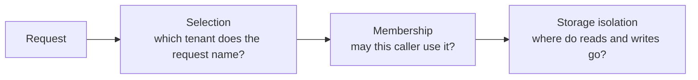

Acme and Globex both use your task application, on the same deployment. A request from an Acme user must only ever read and change Acme's tasks. One missed check, and a Globex user sees a competitor's data.

Arc resolves a tenant for every request, before your code runs, and carries it through commands, queries, services, and storage integrations. You decide how the tenant is selected and how membership is proven. Arc makes sure the answer is the same everywhere in the request.

## Three decisions, kept apart



| Decision | Who makes it |
| --- | --- |
| **Selection** | Arc, from the source you configure: a header, a claim, a subdomain, or your own resolver |
| **Membership** | Arc with `tenancy.membershipClaim`, your `tenancy.resolve`, or your authorization rules |
| **Storage isolation** | The storage integration: a MongoDB database, a Drizzle connection, or a Chronicle namespace per tenant |

Each decision depends on the one before it, and none replaces another. A separate database per tenant does not stop a Globex user from naming Acme in a header. [Storage isolation](isolation.md) covers the third decision.

## Three ways to select a tenant

| Configuration | Behavior |
| --- | --- |
| Nothing | Arc reads the `x-cratis-tenant-id` header unchanged. Missing header means `tenantId` is `undefined` |
| `tenancy: { resolve(request, principal) }` | Your resolver alone decides, after authentication, and may be `async`. Returning `undefined` means no tenant; there is no fallback |
| `tenancy: { sources: [...] }` | Ordered built-in sources with optional `required` and membership checks; see [Tenant resolvers](resolvers.md) |

`tenancy.resolve` overrides built-in sources; `tenancy.httpHeader` customizes the header when using the built-in header source.

```typescript
import { ArcApplication, TenantResolverType } from '@cratis/arc.core';

const builder = ArcApplication.createBuilder({
    authentication: [/* verified handlers */],
    tenancy: { sources: [TenantResolverType.Claim, TenantResolverType.Header], claimType: 'tenant', membershipClaim: 'tenants', required: true }
});
```

This tries an own `tenant` claim on the verified principal first, then the header. A missing tenant answers 400; a selected tenant that is not listed in the principal's comma-separated `tenants` claim answers 403. Both checks run before authorization, validation, or your code.

:::danger[A header is a request, not proof]
Without `tenancy.membershipClaim` or `tenancy.resolve`, Arc takes the header unchanged and does not check membership. When tenants separate customers' data, derive the tenant from the principal in `tenancy.resolve`, configure a membership claim, or check it in authorization. Never enforce it in a validator: a trusted direct caller can lower blocking severity.
:::

## Read the tenant

Every callback receives the execution context with `tenantId`, `principal`, `correlationId`, `signal`, and `allowedSeverity`. Code without access to that parameter, such as a repository deep in a call chain, can call `currentContext()`. It uses Node.js `AsyncLocalStorage`, so concurrent requests never see each other's context, and it returns `undefined` outside an Arc execution.

In a spec, set the tenant the same way a trusted caller would: `CommandScenario.for(...).withContext({ tenantId: 'acme', principal })`.

## Storage follows the tenant

The storage integrations select per-tenant storage from the resolved tenant:

- [MongoDB](../mongodb/tenancy.md) chooses a database per tenant, and fails without one.
- [SQL with Drizzle](../sql/tenancy.md) calls your `databaseFactory` per tenant, and fails without one.
- [Chronicle](../chronicle/index.md), experimental, appends in the tenant's namespace, or in `Default` when there is none.

[Storage isolation](isolation.md) shows each mapping and how to verify it.

## Best practices

- **Derive the tenant from verified identity when tenants are customers.** Use the `claim` source, or `tenancy.resolve` reading the principal. Keep the header for trusted internal callers.
- **Always prove membership.** Configure `membershipClaim`, check it in `tenancy.resolve`, or add a policy. Selection alone proves nothing.
- **Set `required: true` when every operation is tenant-scoped.** A missing tenant then fails with 400 at the edge, instead of deep in a storage integration.
- **Use stable, lowercase tenant IDs.** Built-in sources lowercase IDs and accept only DNS labels of up to 63 characters. Returning the same form from `tenancy.resolve` keeps every integration aligned.
- **Put the tenant in cache keys, logs, and telemetry.** A cache keyed only by entity ID serves one tenant's data to another.
- **Keep `fixed` and `development` sources for single-tenant or local setups.** Neither checks where a request came from.

## Security considerations

- Tenant resolution runs after authentication, so `tenancy.resolve` and the claim source see a verified principal. Never read identity from the request yourself in a resolver.
- A header, query-string, or subdomain value is a request by the caller. The `subdomain` source reads only a host-verified authority, never the raw `Host` or `X-Forwarded-Host` header; see [Tenant resolvers](resolvers.md).
- Enforce membership in tenancy options or authorization, never in validators.
- `/.cratis/tenants` is an anonymous fixture list for development tools. Never return real tenant inventories from `developmentTenants`; see [Development users and tenants](../identity/development-users-and-tenants.md).
- Treat tenant IDs as internal metadata. Avoid putting them in public URLs or error messages when a customer name would reveal who else uses the system.

## Recap

- Arc selects one tenant per request and exposes it as `context.tenantId` and through `currentContext()`.
- Selection, membership, and storage isolation are separate decisions. Configure all three.
- Headers select, principals prove.

Next, follow one request through all three decisions in [Tenancy end to end](end-to-end.md), or pick your sources in [Tenant resolvers](resolvers.md) and check your storage in [Storage isolation](isolation.md).
