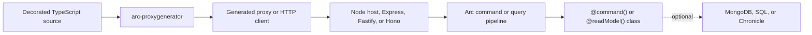

A Node.js backend for a rich frontend writes the same shape for every operation: a route, a body parser, input checks that produce some error format, a call into a service, a status code, a response shape, an authorization check, a tenant lookup, and a typed client in the frontend that someone keeps in step by hand. Add live data and each list also needs its own server-sent events or WebSocket endpoint. None of that is the behavior you set out to write. It is the cost of getting a TypeScript class across HTTP.

## What Arc does instead

You put the behavior on the model. A class decorated `@command()` with a `handle()` method is the command, its validation target, and its endpoint. A class decorated `@readModel()` with static `@query()` methods is the read model and the endpoints that serve it. Arc runs every command and query through one pipeline that owns binding, authorization, validation, tenancy, correlation, error redaction, and status codes, and serves the result over the same [HTTP contract](/arc/http-contract/) as Arc on .NET.

`arc-proxygenerator` reads the same decorated source and writes typed proxies for the published `@cratis/arc` client, including React hooks, so the frontend's types come from the backend's code.

## What you get

| Without Arc | With Arc |
| --- | --- |
| A route and handler per operation, plus the service call | One decorated class; `handle()` or the static query method is the behavior |
| Input checks and error shapes repeated per route | `@field` binding, `CommandValidator` and `ConceptValidator` rules, and one validation result shape with a `/validate` route for every command |
| A hand-kept client, or a spec you maintain beside the code | Proxies generated from your TypeScript source, and OpenAPI served from the same metadata |
| A custom SSE or WebSocket endpoint per live list | Return an RxJS observable; Arc serves a snapshot, server-sent events, WebSockets, and multiplexed hubs |
| Authorization checks sprinkled through handlers | `@authorize`, `@roles`, `@allowAnonymous`, and named policies, evaluated before validation |
| Tenant and correlation handling in every handler | One resolved tenant and correlation ID per request, passed to storage integrations |
| Hand-written event-log plumbing | Optionally, return Chronicle events from `handle()` and let the integration append them |

## Who it is for

- **Teams with an Arc frontend.** If your frontend uses `@cratis/arc` and `@cratis/arc.react`, this server speaks their contract, and the generator writes their proxies.
- **Teams running Arc on .NET and Node side by side.** Both implementations follow one HTTP contract, and a paired suite checks the same requests against both; see [How parity is checked](reference/capabilities.md#how-parity-is-checked).
- **CQRS applications, with or without event sourcing.** The core needs no database and no event store. MongoDB, SQL through Drizzle, and Chronicle are separate, optional packages.

## When it is the wrong fit

- **You need a published, stable package today.** Nothing is on npm yet, the version is 0.x, and APIs can still change. You build from this repository's workspace.
- **You need everything Arc on .NET does.** Parity is incomplete and tracked area by area. Read the [capability reference](reference/capabilities.md) before you plan around a feature; the Chronicle integration in particular is experimental.
- **You design your HTTP API resource by resource.** Arc's contract is fixed: commands are POST requests, queries are GET or HTTP `QUERY` requests, and results come in Arc's envelopes. If clients depend on a hand-shaped REST or custom wire format, Arc's conventions will fight you.
- **You need live queries over SQL.** The Drizzle integration serves snapshots and pages, not change notifications; see [SQL with Drizzle](sql/index.md).
- **You deploy to a runtime Arc has not been run on.** The Node host and adapters are checked, and the Fetch entry runs in Deno; Bun, Cloudflare Workers, and Next.js deployments have not been exercised. See [Fetch API runtimes](hosts/fetch-runtimes.md).
- **You have a handful of endpoints and no frontend to generate for.** The pipeline and conventions pay off across many operations and a typed client. A single webhook receiver does not need them.

## Where to go next

- [Get started](getting-started/index.md): run the Tasks sample and call its command and query.
- [Hosting overview](overview.md): choose the standalone Node host or a framework adapter.
- [Architecture](architecture.md): the core, the adapters, and how Arc concepts map to TypeScript.
